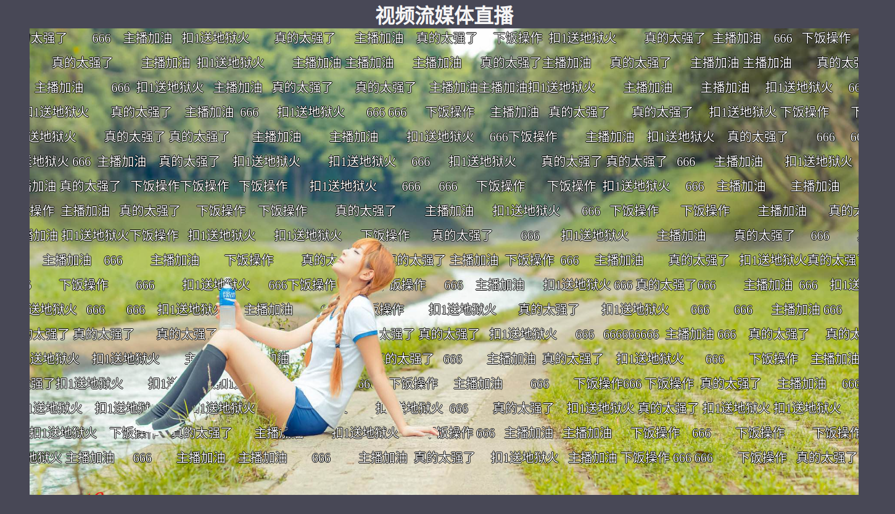

# 直播弹幕防遮挡
基于论文
[SparseInst](https://openaccess.thecvf.com/content/CVPR2022/papers/Cheng_Sparse_Instance_Activation_for_Real-Time_Instance_Segmentation_CVPR_2022_paper.pdf)，与[项目](https://github.com/Kr1s77/flask-video-streaming-recorder)的直播弹幕防遮挡系统

# Start
需要先到sparseInst下载[训练好的模型](https://drive.google.com/file/d/1MK8rO3qtA7vN9KVSBdp0VvZHCNq8-bvz/view?usp=sharing)放到`./SparseInst`下
```py
cd flask-video-streaming-recorder
python main.py
```
账号admin
密码admin
# 主界面html文件位置
`controller/templates/index.html`
# 效果图


